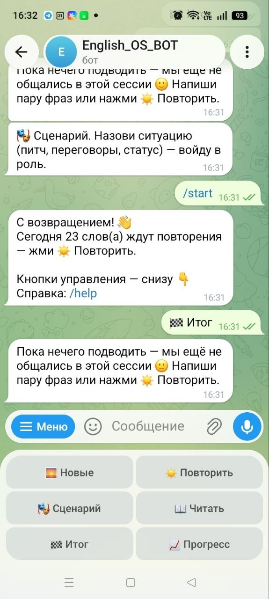
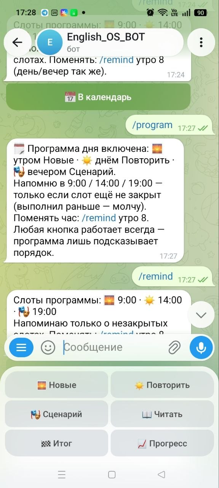
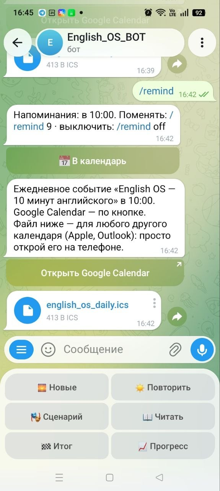
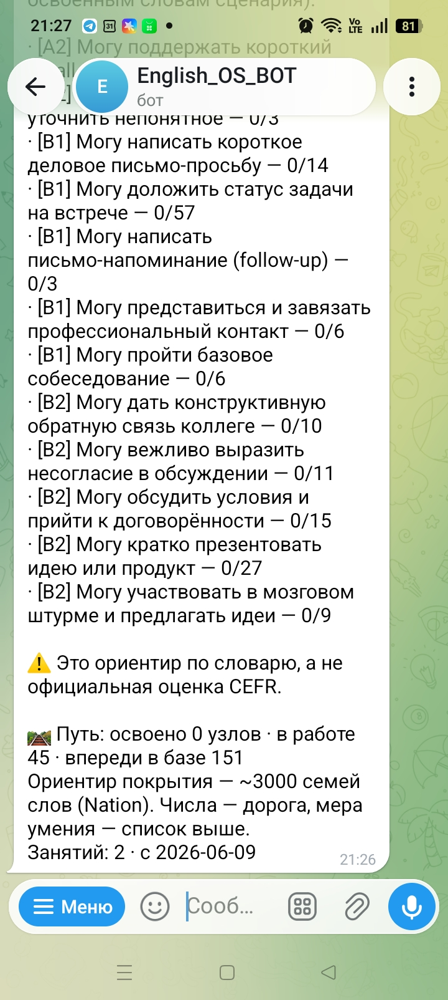
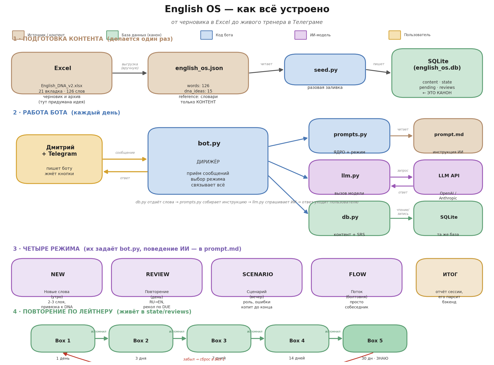

# English OS 🧠

**Лингвистический экзоскелет: ИИ-тренер делового английского в Telegram для русскоязычных взрослых.**

Не «выучи 5000 слов», а «скажи это на встрече». English OS берёт на себя рутину запоминания и сборки фраз, чтобы вы быстрее переходили от «знаю слова» к «говорю по делу».

<p align="center"></p>

---

## В чём идея

Человек учил английский годами — а на рабочей встрече молчит. Дело не в способностях, а в том, *чему* учили: списки слов дают «знание о языке», но не речь. English OS строится на другом:

- **Слово — не перевод, а узел связей.** За каждым словом — сеть из 7 слоёв: смысловая идея → корень → семья слов → коллокации → фразовые глаголы → рабочий сценарий → шаблон мысли. Именно так смысл хранится в голове.
- **Мы говорим готовыми блоками.** 52–58% живой речи — формульные сочетания (`gain traction`, `reach agreement`). Учим сразу блоками, а не словами.
- **Запоминание — на доказанных механиках**: интервальное повторение, продуктивный recall (RU→EN для зрелых слов), выталкивание к продукции, понятный ввод i+1.
- **Прицельная борьба с интерференцией русского** — прежде всего порядок слов (SVOMPT): *I yesterday went home* → *I went home yesterday*.

## Честность — часть методики

Редкость для edtech: мы **прямо маркируем**, что доказано наукой, а что — наша рабочая гипотеза.

| Утверждение | Статус |
|---|---|
| Интервальное повторение работает | 🔬 доказано (Cepeda et al., мета-анализ 317 экспериментов) |
| Коллокации/чанки → беглость | 🔬 доказано (lexical approach) |
| Продуктивный recall для зрелых слов | 🔬 доказано (Terai et al., 2021) |
| Понятный ввод i+1, правило 98% | 🔬 доказано (Krashen, Nation) |
| Подача слова «во всех слоях» лучше плоской карточки | 🟧 гипотеза — **измеряем сами** (A/B встроен в продукт) |
| «Английский меняет мышление» | ❌ не обещаем. Формируем речевую привычку |

Полная методология — в [каноне методики](docs/English_OS_Methodology_Canon.md) с источниками и планом проверки гипотез.

---

## Что умеет бот

### 🗓 Программа дня
Цикл «утро → день → вечер»: новые слова → повторение → ролевой сценарий. Карта дня показывает, что закрыто; напоминания приходят в ваши минуты (хоть 8:30) — и **только если слот ещё не закрыт**. Никакого чувства вины: программа подсказывает, а не заставляет. Свободный режим — в один тап.

<p align="center"></p>

### ☀️ Умные карточки (SRS Лейтнера + maintenance)
Интервалы 1→3→7→14→30 дней. Направление растёт со зрелостью слова: сначала узнавание (EN→RU), потом продукция (RU→EN). «Выученное» не выучено навсегда — каждые 90 дней слово приходит на проверку выживания.

<!-- TODO скриншот: карточка повторения с кнопками «Показать ответ» / «Вспомнил / Забыл» -->
<!-- <p align="center"></p> -->

### 🎭 Сценарии без перебиваний
Питч инвестору, переговоры, собеседование. Бот держит роль как живой собеседник и **не исправляет ошибки по ходу** — копит молча и разбирает в конце, как хороший наставник. Ошибки попадают в личный журнал паттернов (`/mistakes`): не «50 правок», а «у тебя системно хромает порядок слов — вот образец».

<!-- TODO скриншот: фрагмент сценария + финальный ИТОГ сессии -->
<!-- <p align="center"></p> -->

### 📖 Чтение под ваш уровень
Тексты по правилу 98%: почти всё — из слов, которые вы уже знаете, ~2% — целевые новые. Строится из **вашего** словаря, а не из общего учебника.

### 🎤 Голос, 🏁 авто-итог, 📅 календарь
Говорите голосовыми — бот понимает. Замолчали на 25 минут — сам подведёт итог сессии и запишет прогресс. Кнопка «📅 В календарь» ставит ежедневное событие в Google Calendar или любой другой (.ics) — без OAuth.

<p align="center"></p>

### 📈 Прогресс по делу
Не «пройдено 200 слов», а CEFR-style can-do: «могу написать письмо-просьбу», «могу пройти собеседование». Числа — только как дорога к покрытию (~3000 семей слов по Nation).

<!-- TODO скриншот: /progress — список can-do + сводка пути -->
<!-- <p align="center"></p> -->

### 🔑 Для владельца
- **Доступ-по-заявке**: незнакомец стучится → вам карточка с кнопками [Впустить / Отклонить]; `/users` — все пользователи с ролями и прогрессом.
- **Живой контент-конвейер**: `/fill Restaurant 15` — ИИ подбирает слова по частотным спискам (NGSL/Oxford), раскладывает на 7 слоёв, кладёт в очередь на ваше подтверждение. Правило: **база > генерация** — модель получает проверенные данные, а не выдумывает латынь.

---

## Как устроено

<!-- СКРИНШОТ/СХЕМА: english_os_scheme.png из корня проекта -->
<p align="center"></p>

```
контент (JSON/ИИ-конвейер) ─▶ SQLite (граф слов + SRS + роли) ◀─▶ bot.py ◀─▶ Telegram
                                        ▲                            │
                              грунтовка проверенными данными    модульный промпт
                                        └────────── LLM (OpenAI / Anthropic)
```

Ключевые решения:
- **SQLite — единственный источник истины**; граф связей (корни, семьи, коллокации) — реляционные таблицы, по которым ИИ «ходит».
- **Грунтовка вместо выдумки**: в каждый вызов модели подмешиваются проверенные данные слов и профиль ученика из фактов.
- **Модульный промпт**: ЯДРО + модуль режима (~900 токенов вместо монолита).
- **A/B-инструментовка зашита заранее**: вариант карточки, время ответа и направление пишутся в журнал — главная гипотеза проверяема без переделки продукта.
- **Минимум зависимостей**: `python-telegram-bot` + стандартная библиотека. LLM-вызовы — чистый `urllib`.

## Быстрый старт

```bash
pip install -r requirements.txt
python seed.py                 # один раз: контент → SQLite

# .env рядом с ботом:
#   TELEGRAM_TOKEN=...         # от @BotFather
#   LLM_API_KEY=...            # OpenAI или Anthropic
#   OWNER_ID=...               # ваш Telegram id (админка и заявки)

run_bot.cmd                    # Windows: двойной клик, автоперезапуск при падении
# или: python bot.py
```

Без `LLM_API_KEY` бот работает на заглушке — каркас (карточки, SRS, меню) можно гонять локально бесплатно.

## Тесты

```bash
python -m pytest    # 99 тестов: SRS-переходы, контракт ИТОГ, программа дня,
                    # авто-итог, доступ, парсинг времён, миграции
```

Плюс живые прогоны на реальной модели: `live_check_summary.py` (контракт итога) и `live_check_modes.py` (дисциплина ролей в сценариях).

## Статус

Ранний MVP в активной разработке. Доступ — по заявке у владельца. Открытые гипотезы и план их проверки — в [каноне](docs/English_OS_Methodology_Canon.md), журнал решений — в [Decision Log](docs/Decision_Log.md), честное позиционирование — в [positioning_honest](docs/positioning_honest.md), внутренняя техдокументация — в [DEVELOPMENT.md](DEVELOPMENT.md).

---

*English OS не заменяет языковую среду — он снимает рутину запоминания и сборки фраз, чтобы вы быстрее заговорили по делу.*
